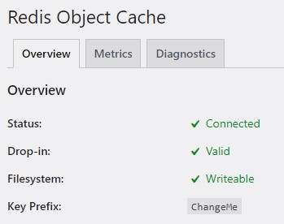

# Tooling

Sword comes with some tooling to help you manage the development environment.

## PHP image

Assuming you've installed Sword using Docker, you'll get [PHP images](https://github.com/phpsword/docker-images) ready for development
and production that's also tailored for Symfony and WordPress.

The PHP extensions are the same as the one used by the official WordPress image, with the
addition of the Redis extension compiled with igbinary (used for faster PHP serialization).

::: warning MACOS USERS
Arm64 builds (Apple M1/M2 chips) have redis and igbinary active but not working together due to compatibility issues while compiling.
:::

These images are based on [williarin/docker-images](https://github.com/williarin/docker-images) which are automatically built
every week with the latest Alpine Linux, PHP and extensions versions.

## Redis

To activate redis in WordPress, the first step is to modify your `docker-compose.yml` file like this:

```yaml
services:
    php:
        # ...
        environment:
            # ...
            WORDPRESS_REDIS_HOST: redis
            WORDPRESS_REDIS_PASSWORD: ChangeMe
            WORDPRESS_CACHE_KEY_SALT: ChangeMe
        # ...

    # ...
    redis:
        image: redis:alpine
        restart: 'no'
        command: /bin/sh -c 'redis-server --appendonly yes --requirepass $${REDIS_PASSWORD}'
        volumes:
            - redis_data:/data
        environment:
            REDIS_PASSWORD: ChangeMe

volumes:
    # ...
    redis_data:
```

Then run:

```bash:no-line-numbers
make up
```

This will download and reconfigure WordPress to connect to Redis.

Finally, you need the Redis plugin on WordPress, which can be downloaded and configured with these commands:

```bash:no-line-numbers
# Download the plugin using Composer
composer require wpackagist-plugin/redis-cache
# Import the drop-in into our wp/content/ directory
cp wp/content/plugins/redis-cache/includes/object-cache.php wp/content/
# Run WP-CLI command to activate the plugin
docker compose exec -u 82:82 php bin/console wp plugin activate redis-cache
```

That's it. If you go to the Redis plugin options in Settings➔Redis, you should see that the connection is active.



## WP-CLI

WP-CLI is runnable through Symfony as a console command. This is how you run the `wp` command:

```bash:no-line-numbers
docker compose exec -u 82:82 php bin/console wp
```

You don't need to specify `--path` as it's automatically set by the command.

::: tip
When running WP-CLI commands, it's recommanded to run them using the www-data user, which is 82 on Alpine Linux.

For simplicity, you can create an alias in your `~/.bashrc` file:
```bash:no-line-numbers
alias wp='docker compose exec -u 82:82 php bin/console wp'
```
:::


## Production

To build for production, use the `docker-compose.prod.yml` in your CI.
This will embed your source files in the production PHP image and give you a staging image that you can test
on your staging server.

Moreover, if you're using Docker Swarm or Kubernetes with secrets, you can simply append `_FILE` to all the
environment variables. As an example:

```yaml
services:
    php:
        # ...
        environment:
            # ...
            WORDPRESS_DB_PASSWORD_FILE: /run/secrets/myproject-db-password
            WORDPRESS_AUTH_KEY_FILE: /run/secrets/myproject-auth-key
            # ...
```

## Makefile

Sword also comes with a handy Makefile with commands to ease working with Docker.

If you're unfamiliar with `make`, it's a task runner just like the Symfony console, but for your shell.

Here are the commands you can use by running:

```bash:no-line-numbers
make <command>
```

App commands:

* `cc` Clear Symfony cache
* `upgrade` Upgrade database after a WordPress upgrade
* `opcache` Clear opcache
* `acl` Reset project files and directories read/write permissions to current user if needed

Docker commands:

* `build` Build containers
* `up-build` Build containers and run them
* `up` Run containers
* `stop` Stop containers
* `down` Remove containers but keep volumes
* `remove` Remove containers and volumes
