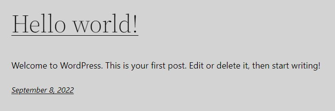
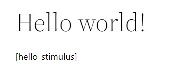
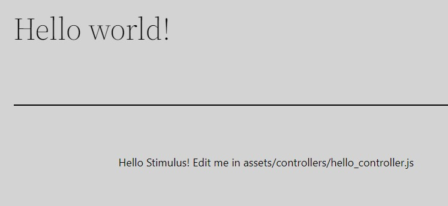

# Assets

This section will show you how to render Symfony assets in WordPress.

::: tip NOTE
We'll simply use the default assets that Symfony gives us for a new project installation, and render
a Stimulus controller in a WordPress page. You don't need to create js or css files for this tutorial.
:::

## Install Encore and build assets

A fresh Sword project doesn't have Encore installed yet. Install it by running this command:

```bash:no-line-numbers
composer require symfony/webpack-encore-bundle
```

And build the assets:

```bash:no-line-numbers
yarn install
yarn dev
```

## Render scripts and styles on WordPress

Unlike a regular Symfony app using Twig templates, we need to print the `<script>` and `<style>` tags
in a WordPress template. To do that we'll hook `wp_head` for the CSS and `wp_footer` for the JavaScript.

```php
<?php

declare(strict_types=1);

namespace App\Wordpress;

use Sword\SwordBundle\Service\AbstractWordpressService;
use Symfony\Component\DependencyInjection\Attribute\Autowire;
use Symfony\WebpackEncoreBundle\Asset\TagRenderer;

final class Assets extends AbstractWordpressService
{
    public function __construct(
        #[Autowire('@webpack_encore.tag_renderer')]
        private readonly TagRenderer $tagRenderer,
    ) {
    }

    public function initialize(): void
    {
        add_action('wp_head', [$this, 'renderSymfonyStyles']);
        add_action('wp_footer', [$this, 'renderSymfonyScripts']);
    }

    public function renderSymfonyStyles(): void
    {
        echo $this->tagRenderer
            ->renderWebpackLinkTags('app', null, '_default', []);
    }

    public function renderSymfonyScripts(): void
    {
        echo $this->tagRenderer
            ->renderWebpackScriptTags('app', null, '_default', []);
    }
}
```

::: tip NOTE
The code above is the equivalent of calling twig functions `{{ encore_entry_link_tags('app') }}` and `{{ encore_entry_script_tags('app') }}`.

[Read more about the frontend in Symfony](https://symfony.com/doc/current/frontend.html)
:::

At this point, you should notice your page became gray, because the example CSS file `/assets/styles/app.css` sets `body` to gray.



## Create a shortcode for a Stimulus controller

Now let's create a shortcode so we don't have to edit the page template.

```php
<?php

declare(strict_types=1);

namespace App\Wordpress;

use Sword\SwordBundle\Service\AbstractWordpressService;
use Twig\Environment;

final class HelloStimulusShortcode extends AbstractWordpressService
{
    public function __construct(
        private readonly Environment $twig,
    ) {
    }

    public function initialize(): void
    {
        add_shortcode('hello_stimulus', [$this, 'renderShortcode']);
    }

    public function renderShortcode(): string
    {
        return $this->twig->render('wordpress/shortcode/hello_stimulus.html.twig');
    }
}
```

And its template `/templates/wordpress/shortcode/hello_stimulus.html.twig`:

```twig
<div {{ stimulus_controller('hello') }}></div>
```

## Insert the shortcode in post

Final step, edit `Hello world!` post and insert the shortcode in the content.



And admire the rendered page:


